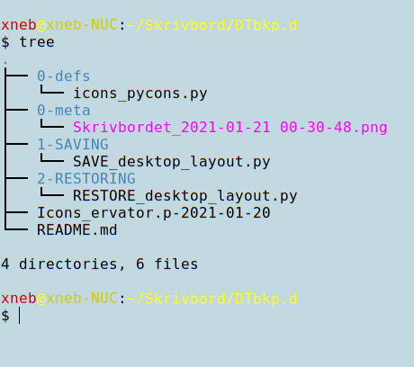

    

&nbsp;

## Icons_pycons
A pair of function definitions for saving and restoring the preferred spatial positions of the set of all current desktop icons.

Hopefully useful in case one's cherished handcrafted desktop layout has been 
accidentally deleted, e.g. by clicking the inexplicable contextual menu 
option "Organize desktop by name", which naturally can't be undone...

The names of icons' corresponding files must have *no leading or trailing spaces*.

Tested on Ubuntu Mate 20.04, using the Caja file manager and python3. 
Requires **gio** and **egrep**.

Based on a rather more elaborate script provided by [RockDoctor](https://www.linuxquestions.org/questions/attachment.php?attachmentid=35284&d=1610746200).

By [moof-moof](https://github.com/moof-moof?tab=repositories) 2021-01-20.

&nbsp;

### To make a backup of the names and positions of the desktop icons:
    
1)  Open a terminal in the directory "1-SAVING".
    
2)  Issue `python3 SAVE_desktop_layout.py`.
    
3)  Note terminal output and the newly created pickle (*.p-YYYY-MM-DD) file in the configured backup directory.

&nbsp;

### To later restore all the desktop icons to their saved positions:
   
1)  Copy desired pickled file w/o date suffix to the configured backup directory.
    
2)  Open a terminal in the directory "2-RESTORING".
    
3)  Issue `python3 RESTORE_desktop_layout.py`.
    
4)  Note terminal output, which have ideally present none or very few `returncode=1` messages).
    
5)  Update filemanager by clicking the desktop while hitting **F5**.
    

